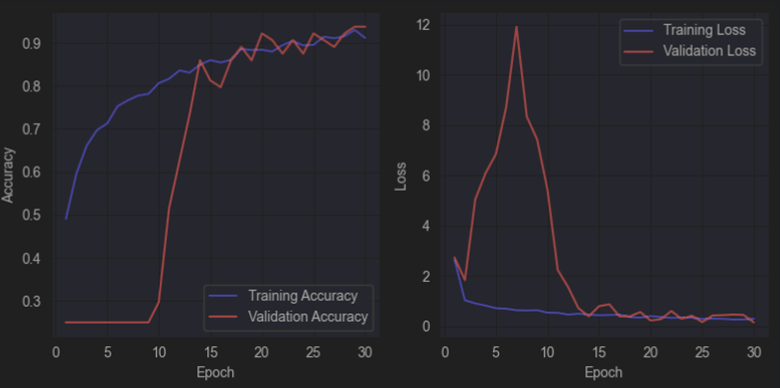

# **Durian Disease Classification Project using Image Processing and Machine Learning**
This project aims to identify foliar diseases affecting durian crops using ML & DL algorithms and architectures.
A total of 5 disease classification models and a YOLOv8 leaf detection model was developed in this project.

## **Project Overview**
The project employed various image processing and post-processing techniques towards increasing the complexity of the project. Several of said methods include:
* Dual-Phase Pixel & Spatial Augmentations using [Albumentations](https://github.com/albumentations-team/albumentations) and Keras.
* Bounding Box Annotations using VGG Image Annotator
* Standalone YOLOv8 model for Leaf Detection
* Stress Test evaluation for Model Robustness
* SoftMax Temperature Scaling for Model Confidence Calibration

## **Table of Contents**
- [Dataset](#dataset)
- [Data Exploration](#data-exploration)
- [Data Preparation](#data-preparation)
- [Model Building & Evaluation](#model-building--evaluation)
- [Model Comparion](#model-comparison)
- [Deployment](#deployment)
- [Conclusion](#conclusion)

## **Dataset**
The **Durian Leaf Disease Dataset** consists of 420 images of healthy and diseased durian leaves. The images are spread across four classes, specifically Algal Leaf Spot, Leaf Spot, Leaf Blight, and No Disease.

***Source:*** [Roboflow- Durian Foliar Disease Dataset](https://universe.roboflow.com/dsi444/durian-disease/dataset/5)

## **Data Exploration**
An initial Exploratory Data Analysis (EDA) was conducted to thoroughly explore the images in the dataset.

### Sampling Images per Class
Several images were selected randomly from each class and displayed.

### Class Distribution
All the classes were equally distributed between a range of 103 to 105 images. However, there appears to be 2 outlier images representing both Leaf Spot and No Disease classes.

### Image Dimension Distribution
The images in dataset were of an equal aspect ratio, specifically 640 x 640 pixels height and width.

### Brightness Distribution
Based on the graph, the brightness level is normally distributed with an approximate mode of 118 pixels. This indicates that the images were taken in medium-lit environments and contains robust data for poor-lit and well-lit environments.

### RGB Color Analysis
The Green and Red distribution is more profound than Blue. This is observed by the large peak of Blue at a pixel intensity of 0. The Green color space is more prominent in pixel intensity of 255, which could be attributed to the primary content of images being leaves, shruberry, and greenery.

### Data Duplication Check
The Perceptual Hashing technique was used to extract hash information from the image contents and compared with other images. From this analysis, it was found that no duplicate images were present

## **Data Preparation**
### Data Removal
There are uncertainties on whether the double labels found in 2 images during the class distribution were due to human error or indicators for a multi-classification task. Therefore, it was decided to remove the outlier images as the quantity was limited.

### Image Resizing
All the images were rescaled from their original dimensions of 640 x 640 to 224 x 224 pixels. This is to standardize the aspect ratio to the common size used in pre-trained models like VGG-19.

### Image Normalization
The pixel intensity values ranging from 0 to 255 were normalized into a range between 0 and 1.

### Dataset Sampling & Splitting
The dataset was split into training, test, and validation sets with a ratio of 70:15:15

### Data Augmentation
A dual-phase augmentation strategy was implemented on the training data to increase the quantity of data available for the model to train on:

#### Pixel-Level Augmentations via Albumentations library
For each image, 4 augmentations were randomly selected in creating 4 augmented versions of each original training data.
* CLAHE/ Contrast Limited Adaptive Histogram Equalization
* HueSaturationValue
* MotionBlur
* PlanckianJitter
* Sharpen

#### Spatial-Level Augmentations via Keras' ImageDataGenerator
The expanded training set was further augmented on-the-fly using Keras' ImageDataGenerator.
* Rotation by 30 degrees
* Shift in width and height by 20%
* Shear 20% of the image
* Zoom
* Flipping across horizontal axis.
* Brightness shift by 20%

#### Stress Test Dataset
Using a similar strategy as above, the test dataset was also augmented to create a separate stress test dataset, to be used as a metric in assessing model robustness.

### Bounding Box Annotations
The [VGG Image Annotator](https://www.robots.ox.ac.uk/~vgg/software/via/via_demo.html) tool was used to draw bounding boxes around each leaf object. This is the base step towards constructing the Leaf Detection model.

The bounding box annotations were used to crop the region of interest containing leaf object, cropping it, and padding the outer area with black background. 

### Leaf Detection Dataset Creation
For the leaf detection dataset, 1 of each pixel and spatial augmentations were applied on training image and the process is repeated 3 times to create 3 augmented versions. The Albumentations library was leveraged due to is potential in supporting [bounding box augmentations](https://albumentations.ai/docs/3-basic-usage/bounding-boxes-augmentations/).

**Pixel-Level Augmentations:**
* RandomBrightnessContrast
* PlanckianJitter
* Downscale
* CLAHE
* HueSaturationValue
* MotionBlur
* Sharpen

**Spatial-Level Augmentations:**
* Horizontal Flip
* Vertical Flip
* Affine
* Perspective
* RandomSizedBoxSafeCrop
* RandomResizedCrop

### Manual Feature Extraction
For traditional ML models, image features have to be manually defined and extracted beforehand as they do not accept raw image inputs.

**Features:**
* Gray-Level Co-occurence Matrix (GLCM)
  * Contrast
  * Dissimilarity
  * Homogenity
  * Energy
  * Correlation
* Local Binary Pattern (10 bins)
* Histogram of Oriented Gradients (Mean, Std. Deviation)
* Red Green Blue Color Space (Mean, Std. Deviation)
* Hue Saturation Value (HSV) Color Histogram (9 bins)
* Sobel Edge features (Mean, Std. Deviation)

## Model Building & Evaluation
A total of 5 leaf disease classification models were developed across three different categories. A standalone YOLO model was also created for leaf detection.
### Traditional Machine Learning Models
#### Support Vector Machine
* **Hyperparameter Tuning:** C, Kernel, Gamma, Degree, Coef0
* **Results:** 
  * Accuracy: 91.17%
  * Stress Test: 82.14%

#### Random Forest
* **Hyperparameter Tuning:** n_estimators, max_depth, criterion, min_samples_split
* **Results:** 
  * Accuracy: 89.59%
  * Stress Test: 81.35%

### Deep Learning Approach
#### Convolutional Neural Network
An architecture test was conducted to identify the optimal number of convolutional layers and dense layers for hyperparameter tuning.
* **Architecture Test**
  * Testing the performance of 2 to 4 Conv2D layers and 1 to 2 fully connected Dense layers.
  
  
* **Hyperparameter Tuning:** Dense layer neurons, Dropout, Optimizer, Learning rate
* **Results:** 
  * Accuracy: 98.41%
  * Stress Test: 83.73%

### Pre-Trained Models
The pre-trained weight layers were unfrozen as part of its fine-tuning process. No hyperparameter tuning was conducted.
#### MobileNetV2
* **Fine Tuning:** 10 layers unfrozen with learning rate of 0.00001 for 10 epochs
* **Results:**
  * Accuracy: 96.83%
  * Stress Test: 96.43%

#### VGG-19
* **Fine Tuning:** 5 layers unfrozen with learning rate of 0.00001 for 10 epochs
* **Results:**
  * Accuracy: 96.83%
  * Stress Test: 93.25%

## Model Comparison
* CNN had highest accuracy, but stress test shows it isn't robust enough
* MobileNet had second-best performance, but showed higher error rate in deployment environment compared to VGG-19.
* VGG-19 was selected as best-fit model for deployment.

## VGG-19 Optimization
* Shows poor performance (8% decrease) against cropped and black-padded images/ YOLO output

* The final model was fine-tuned on a dataset of cropped and padded images.

* Results indicate performance increase of 3% against YOLO output images.

## Model Deployment
* The durian disease classification system is deployed using Streamlit library.
* Composed of two models:
  * YOLOv8 for leaf detection
  * VGG-19 for disease classification
  

* **System Overview:**

* **SoftMax Temperature Scaling:**
  * Post-processing technique to calibrate model's confidence level in predictions
  * Important for model to not output wrong predictions with high confidence.
  * Can affect the trust of farmers/end-users who might already be reluctant of the technology.
  * Data-driven tests in determining most optimal SoftMax temperature.
  * *Final SoftMax Temperature: 2.035*

## Conclusion
* VGG-19 model achieved the best performance with accuracy of 96.83% and stress-test accuracy of 93.25%.
* Pre-trained models are great for small-sized datasets or niche/unexplored domains.
* DL approaches showcase a significantly better performance compared to traditional ML algorithms.